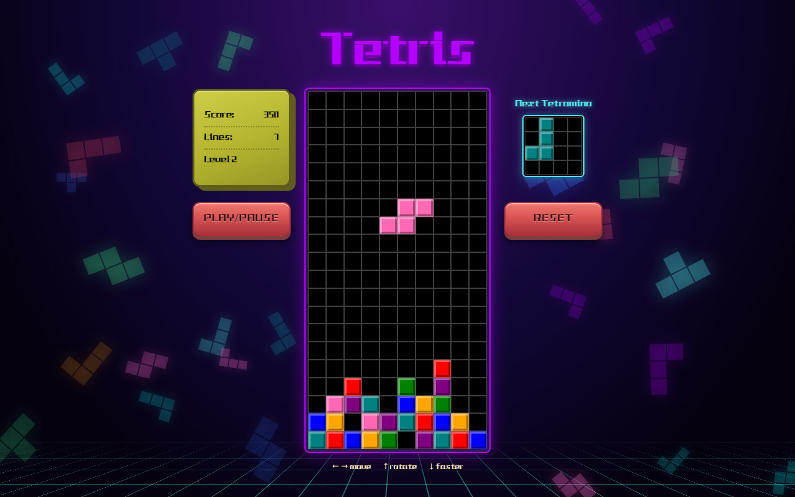
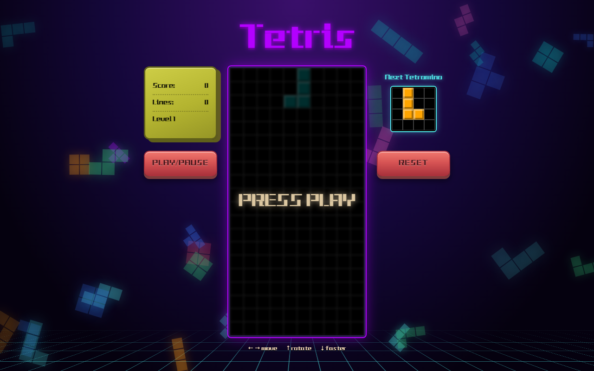
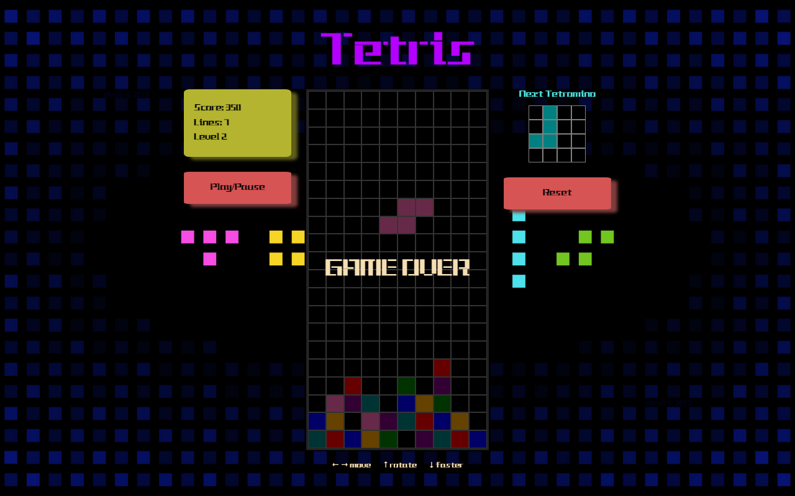
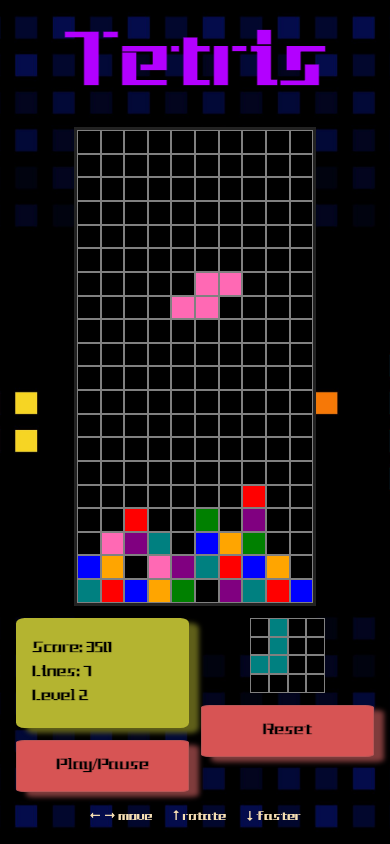

# Project One - Tetris



Play Tetris [here](https://kostasfergadis.github.io/Project-1-Tetris/)

## Table of Contents

1. Project Overview
2. Installation
3. How to Play
4. Game Brief
5. Technologies Used
6. How It Works
7. Timeline
8. Features
9. Wins and Challenges
10. Refactor
11. Future Improvements
12. Key Learnings
13. Credits

## Project Overview

This project is an implementation of the classic game Tetris. It allows the player to move and rotate differently shaped falling pieces, also known as tetrominoes, to clear lines and score points. The game ends when the stack reaches the top of the playing field. The goal was practising and improving my JavaScript, mostly through arrays and their methods.

Tetris is a puzzle video game created by the Soviet software engineer Alexey Pajitnov in 1984. It has been published by several companies for multiple platforms and is one of the best-selling video games of all time.

This was my first project from General Assembly's Software Engineering Immersive course, built in 14 days, and my first real-world practice with JavaScript.

| Start | Game over | Mobile |
| :---: | :---: | :---: |
|  |  |  |

## Installation

No dependencies and no build step.

```
git clone git@github.com:KostasFergadis/Project-1-Tetris.git
cd Project-1-Tetris
open index.html
```

Or serve the folder with any static server (for example the VS Code Live Server extension).

## How to Play

- Click **Play/Pause** to start, click again to pause. **Reset** starts a fresh game.
- Left / right arrow keys move the tetromino.
- Up arrow rotates it.
- Down arrow drops it faster and scores a point per step.
- On phones and tablets use the on-screen arrow buttons (hold to repeat).
- Each completed line is worth 50 points.
- A new level starts every 5 lines (level 2 at 5 lines, level 3 at 10, and so on) and the pieces fall faster.
- The game ends when a new tetromino has no room to appear. Press Play/Pause or Reset to go again.

## Game Brief

Although Tetris was one of the most challenging options for our project, I embraced the opportunity to test and enhance my problem-solving and logical thinking abilities. As a first project, it was certainly intimidating, but I was determined to improve my researching skills and learn how to efficiently find solutions to my own problems using online resources like Stack Overflow and ChatGPT.

Before I started with coding I wrote some pseudocode and did some wireframing using excalidraw, so that I could better plan out what I would do each day by breaking the project into smaller parts.
This was the plan I ended up with :

- Write the html and create the grid where the game would take place
- Draw the different tetrominoes on the grid using arrays and write the function to create a tetromino
- Logic for the tetromino to move down and freeze at the last line and when its next to another previously placed tetromino
- Adding key inputs for moving the tetromino left right or down using arrow keys and rotating it with the up arrow
- Figuring out how to remove a horizontal line when filled with tetrominoes
- Adding a game over message for when the tetromino reaches the top
- Adding score lines and levels that change when you complete a number of lines
- Add a reset button and work on the styling using css
- Stretch goals like adding a smaller grid that displays the next falling tetromino, adding sound effects and improving styling
- Bug fixes

## Technologies Used

- HTML5 with HTML5 audio
- CSS3 (grid, flexbox, custom properties, media queries)
- JavaScript (ES6+)
- Git and GitHub
- Google Fonts / CDN Fonts

## How It Works

- The board is a flat array of 200 cells (10 x 20). Each entry is either `null` or the colour of a locked square, and the DOM grid is redrawn from it.
- Each tetromino is a small matrix. Rotations are produced by rotating the matrix, rather than hand-writing four versions of every shape.
- A single `collides()` check is used for moving, falling and rotating, so pieces can never overlap or leave the board.
- Rotating next to a wall or another block tries a few small nudges ("wall kicks") before giving up.
- Completed rows are removed from the array and empty rows are added on top.

## Timeline

### Day 1

Planning. I wrote down what had to be done and broke it into small chunks, leaving room for stretch goals.

### Day 2

Built the grid with a loop that creates the divs and stores them in an array, then styled it. I decided to represent tetrominoes with arrays, each with its four rotations, plus a second array for their colours.

### Day 3

Displaying a tetromino: it starts at the top of the grid, and its absolute position is the current position plus each of its indexes. I wrote a function to make it fall by moving it one row at a time and clearing its previous position.

### Day 4 and 5

Making tetrominoes stop at the bottom and on top of other pieces. My original solution was a hidden extra row under the grid marked as `taken`, which pieces would collide with and freeze against.

### Day 6 and 7

Keyboard controls for moving left and right, moving down faster, and rotating.

### Day 8 and 9

Rotation caused a lot of problems: pieces split when rotated at the edges, and passed through other pieces. The T and L tetrominoes were the hardest to get right.

### Day 10 and 11

Removing completed lines, and a game over state when a piece reaches the top.

### Day 12

Play/pause and reset buttons, sound effects, score/lines/levels, and the first round of styling to give the game an arcade feel.

### Day 13 and 14

Stretch goals: a small grid previewing the next tetromino and speeding the game up as lines are cleared. The rest of the time went on bug fixing and polish, and the game was deployed with GitHub Pages.

## Features

- 10 x 20 grid.
- All seven classic tetromino shapes (I, O, T, L, J, Z, S), each with its own colour.
- Next-piece preview.
- Score, lines and levels, with the fall speed increasing per level.
- Play/pause, reset, and pause / game over overlays.
- Sound effects for locking, rotating, clearing lines, levels, pausing and game over.
- Responsive layout from phones to large monitors, with on-screen buttons on touch devices.

## Wins and Challenges

I was particularly happy when I found a way to freeze a tetromino at the bottom, and when I achieved my stretch goals of the next-piece preview and changing levels.

The biggest challenges were the freeze logic, rotation bugs near walls and other pieces, and level changes and game over, which caused bugs like pausing breaking after a level change and pieces that kept falling after the game had ended.

## Refactor

Revisiting the project later, I cleaned up the code while keeping the look and the rules of the game:

- Replaced the hidden "taken" floor row and per-cell DOM classes with a board array and one collision function.
- Generated tetromino rotations from a single matrix instead of hand-written index lists. This also fixed a duplicated cell in the I piece.
- Added the two missing classic pieces (J and S), bringing the set to all seven.
- Rewrote rotation with wall kicks, replacing the recursive edge checks.
- Game over, pause and reset no longer reload the page; they use an on-board overlay.
- Levels are computed from the line count, and sounds are loaded once instead of reassigning `src` on every play.
- Removed the debugging `console.log`s.
- Rebuilt the layout with CSS grid and flexbox instead of absolute offsets and magic numbers, so it scales to any screen size.

## Future Improvements

- A high-score table.

## Key Learnings

I found the project challenging but a really useful learning experience. Even the blockers were beneficial: I became more used to paying attention to every detail, writing comments, and logging to understand what is going on. I learned to take a break when stuck and look at the problem again with a clear mind, and I improved my research and problem solving skills. With enough trial and error and persistence, anything can be fixed.

## Credits

- Niklas Fischer, SEI instructor, for starter code that helped in the creation of the grids.
- Ania Kubow's Code Tetris: JavaScript Tutorial for Beginners https://www.youtube.com/watch?v=rAUn1Lom6dw
- Sound effects from [Mixkit](https://mixkit.co/).
- Stack Overflow: https://stackoverflow.com/
